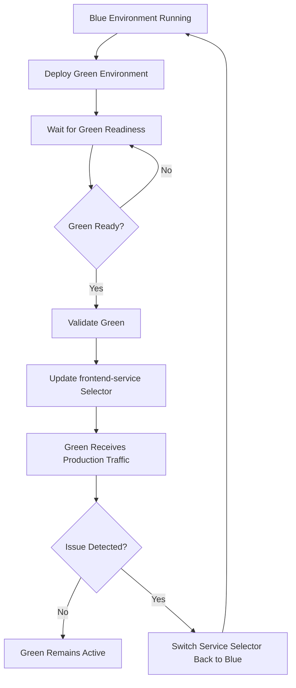

# Blue-Green Deployment Project

A Node.js application demonstrating containerization with Docker and blue-green deployment using Kubernetes on Minikube.

The project contains:
- Express/Node.js backend with MongoDB integration
- Basic Blue frontend
- Enhanced Green frontend
- Docker containerization
- Kubernetes deployments and services
- Blue-green traffic switching using a Kubernetes Service selector

## Architecture

```text
                         MINIKUBE
┌──────────────────────────────────────────────────────────────┐
│                                                              │
│                         Ingress                              │
│                            │                                 │
│                            ▼                                 │
│                  frontend-service                            │
│                     │              │                         │
│                version=blue   version=green                  │
│                     │              │                         │
│                     ▼              ▼                         │
│               Blue Frontend   Green Frontend                 │
│                  :3100           :3200                        │
│                         │                                     │
│                         ▼                                     │
│                  backend-service                              │
│                         │                                     │
│                         ▼                                     │
│                    Backend :5000                              │
│                         │                                     │
│                         ▼                                     │
│                      MongoDB                                  │
│                                                              │
└──────────────────────────────────────────────────────────────┘
```

## Prerequisites

- Git
- Node.js and npm
- Docker Desktop
- Minikube
- kubectl
- Helm (if required by your environment)

Verify the tools:

```bash
git --version
node --version
npm --version
docker --version
minikube version
kubectl version --client
helm version
```

---

## 1. Clone the Repository

```bash
git clone https://github.com/mohanDevOps-arch/Blue-green-Deployment.git
cd Blue-green-Deployment
```

---

# Part 1 - Local Deployment

## 2. Backend Setup

Navigate to the backend:

```bash
cd backend
npm install
```

Create a `.env` file:

```env
PORT=5000
MONGO_URI=mongodb://localhost:27017/bluegreen
```

If MongoDB is running with a different connection string, use that connection string instead.

Start the backend:

```bash
npm start
```

Verify the health endpoint:

```text
http://localhost:5000/health
```

The backend is expected to run on port `5000`.

## 3. Blue Frontend Setup

Open another terminal and navigate to:

```bash
cd frontend-blue
npm install
```

Create `.env`:

```env
PORT=3100
```

Start the Blue frontend:

```bash
npm start
```

Open:

```text
http://localhost:3100
```

The Blue frontend represents the basic application version.

## 4. Green Frontend Setup

Open another terminal:

```bash
cd frontend-green
npm install
```

Create `.env`:

```env
PORT=3200
```

Start the Green frontend:

```bash
npm start
```

Open:

```text
http://localhost:3200
```

The Green frontend represents the enhanced application version.

## 5. Local Functional Verification

Verify the following:

1. Backend health endpoint responds successfully.
2. Blue frontend is accessible on port `3100`.
3. Green frontend is accessible on port `3200`.
4. Users can be registered through the frontends.
5. Registered data is stored in MongoDB.
6. Backend APIs return the expected user data.

Useful backend endpoints:

```text
GET  /health
POST /api/users
GET  /api/users
GET  /api/users/count
```

---

# Part 2 - Dockerization

## 6. Dockerfile Structure

Create the following files:

```text
backend/Dockerfile
frontend-blue/Dockerfile
frontend-green/Dockerfile
```

## 7. Backend Dockerfile

`backend/Dockerfile`:

```dockerfile
FROM node:20-alpine

WORKDIR /app

COPY package*.json ./
RUN npm ci --omit=dev

COPY . .

EXPOSE 5000

CMD ["npm", "start"]
```

## 8. Blue Frontend Dockerfile

`frontend-blue/Dockerfile`:

```dockerfile
FROM node:20-alpine

WORKDIR /app

COPY package*.json ./
RUN npm ci --omit=dev

COPY . .

EXPOSE 3100

CMD ["npm", "start"]
```

## 9. Green Frontend Dockerfile

`frontend-green/Dockerfile`:

```dockerfile
FROM node:20-alpine

WORKDIR /app

COPY package*.json ./
RUN npm ci --omit=dev

COPY . .

EXPOSE 3200

CMD ["npm", "start"]
```

> If the supplied application's `package.json` uses a different start script, use that script instead of `npm start`.

## 10. Build Docker Images

From the project root:

```bash
docker build -t bluegreen/backend:v1 ./backend
docker build -t bluegreen/frontend-blue:v1 ./frontend-blue
docker build -t bluegreen/frontend-green:v1 ./frontend-green
```

Verify:

```bash
docker images
```

---

# 11. Docker Compose

Create `docker-compose.yml` in the project root:

```yaml
services:

  mongodb:
    image: mongo:7
    container_name: bluegreen-mongodb
    restart: unless-stopped
    ports:
      - "27017:27017"
    volumes:
      - mongodb-data:/data/db

  backend:
    build:
      context: ./backend
    container_name: bluegreen-backend
    restart: unless-stopped
    environment:
      PORT: 5000
      MONGO_URI: mongodb://mongodb:27017/bluegreen
    depends_on:
      - mongodb
    ports:
      - "5000:5000"

  frontend-blue:
    build:
      context: ./frontend-blue
    container_name: bluegreen-frontend-blue
    restart: unless-stopped
    environment:
      PORT: 3100
    depends_on:
      - backend
    ports:
      - "3100:3100"

  frontend-green:
    build:
      context: ./frontend-green
    container_name: bluegreen-frontend-green
    restart: unless-stopped
    environment:
      PORT: 3200
    depends_on:
      - backend
    ports:
      - "3200:3200"

volumes:
  mongodb-data:
```

Start the complete stack:

```bash
docker compose build
docker compose up -d
```

Verify:

```bash
docker compose ps
```

View logs:

```bash
docker compose logs
docker compose logs backend
docker compose logs frontend-blue
docker compose logs frontend-green
```

Stop the stack:

```bash
docker compose down
```

To remove the MongoDB volume as well:

```bash
docker compose down -v
```

---

# Part 3 - Kubernetes Deployment

## 12. Start Minikube

```bash
minikube start
```

Verify:

```bash
minikube status
kubectl get nodes
```

Enable the required addons:

```bash
minikube addons enable metrics-server
minikube addons enable ingress
```

Verify the addons if required:

```bash
minikube addons list
```

---

# 13. Kubernetes Manifest Structure

Create a `k8s` directory:

```text
k8s/
├── namespace.yaml
├── mongodb-deployment.yaml
├── mongodb-service.yaml
├── backend-deployment.yaml
├── backend-service.yaml
├── frontend-blue-deployment.yaml
├── frontend-green-deployment.yaml
├── frontend-service.yaml
└── ingress.yaml
```

The exact manifests should match the Docker images, ports, environment variables, and application endpoints used by the project.

---

# 14. Blue Frontend Deployment

The Blue deployment must use labels that identify it as the Blue version:

```yaml
labels:
  app: frontend
  version: blue
```

Example `frontend-blue-deployment.yaml`:

```yaml
apiVersion: apps/v1
kind: Deployment
metadata:
  name: frontend-blue
spec:
  replicas: 2
  selector:
    matchLabels:
      app: frontend
      version: blue
  template:
    metadata:
      labels:
        app: frontend
        version: blue
    spec:
      containers:
        - name: frontend
          image: bluegreen/frontend-blue:v1
          imagePullPolicy: Never
          ports:
            - containerPort: 3100

          readinessProbe:
            httpGet:
              path: /
              port: 3100
            initialDelaySeconds: 5
            periodSeconds: 10

          livenessProbe:
            httpGet:
              path: /
              port: 3100
            initialDelaySeconds: 15
            periodSeconds: 20
```

---

# 15. Green Frontend Deployment

The Green deployment uses:

```yaml
labels:
  app: frontend
  version: green
```

and the Green frontend listens on port `3200`.

The deployment should use the same application label as Blue but a different version label so that the Service can select either environment.

---

# 16. Frontend Service - Blue Active

The frontend Service is the main component used for blue-green switching.

Initial configuration:

```yaml
apiVersion: v1
kind: Service
metadata:
  name: frontend-service
spec:
  type: ClusterIP
  selector:
    app: frontend
    version: blue
  ports:
    - protocol: TCP
      port: 80
      targetPort: 3100
```

The important section is:

```yaml
selector:
  app: frontend
  version: blue
```

This tells Kubernetes to send Service traffic to Pods having:

```text
app=frontend
version=blue
```

---

# 17. Deploy Kubernetes Resources

After all required manifests have been created:

```bash
kubectl apply -f k8s/
```

Verify deployments:

```bash
kubectl get deployments
```

Verify Pods:

```bash
kubectl get pods
```

Verify Services:

```bash
kubectl get services
```

Verify endpoints:

```bash
kubectl get endpoints
```

For detailed information:

```bash
kubectl describe deployment frontend-blue
kubectl describe service frontend-service
```

---

# 18. Health Checks and Readiness

The frontend deployments use:

- `readinessProbe` to determine whether a Pod is ready to receive traffic.
- `livenessProbe` to determine whether a running container is healthy.

For the backend, configure probes against the application's health endpoint:

```text
/health
```

Example:

```yaml
readinessProbe:
  httpGet:
    path: /health
    port: 5000
  initialDelaySeconds: 5
  periodSeconds: 10

livenessProbe:
  httpGet:
    path: /health
    port: 5000
  initialDelaySeconds: 15
  periodSeconds: 20
```

---

# Part 4 - Blue-Green Deployment

## 19. Blue-Green Strategy

The project maintains two frontend environments:

```text
Blue  = Basic frontend
Green = Enhanced frontend
```

Both deployments can run simultaneously.

Only one version is selected by `frontend-service`.

Initial state:

```text
frontend-service
       |
       | version=blue
       v
Blue Frontend
```

After the Green deployment has been created and validated:

```text
frontend-service
       |
       | version=green
       v
Green Frontend
```

Blue remains deployed after the switch so it can be used for rollback.

---

# 20. Switch Blue to Green

Using the Service selector, switch traffic to Green:

```bash
kubectl patch service frontend-service   --type='merge'   -p '{"spec":{"selector":{"app":"frontend","version":"green"},"ports":[{"port":80,"targetPort":3200}]}}'
```

Verify:

```bash
kubectl describe service frontend-service
kubectl get endpoints frontend-service
```

The selector should show:

```text
app=frontend,version=green
```

Traffic should now be sent to the Green frontend.

---

# 21. Roll Back Green to Blue

If the Green deployment has an issue, switch traffic back:

```bash
kubectl patch service frontend-service   --type='merge'   -p '{"spec":{"selector":{"app":"frontend","version":"blue"},"ports":[{"port":80,"targetPort":3100}]}}'
```

Verify:

```bash
kubectl describe service frontend-service
kubectl get endpoints frontend-service
```

The selector should again show:

```text
app=frontend,version=blue
```

This provides a fast rollback without removing the Green deployment.

---

# 22. Verify the Blue-Green Switch

Before switching:

```bash
kubectl get pods --show-labels
kubectl describe service frontend-service
kubectl get endpoints frontend-service
```

Confirm that the Service selects:

```text
version=blue
```

Deploy and validate Green.

Then switch:

```bash
kubectl patch service frontend-service   --type='merge'   -p '{"spec":{"selector":{"app":"frontend","version":"green"},"ports":[{"port":80,"targetPort":3200}]}}'
```

Confirm:

```bash
kubectl describe service frontend-service
```

The Service should now select:

```text
version=green
```

---

# 23. Application Verification

Verify the following after deployment:

```bash
kubectl get pods
kubectl get deployments
kubectl get services
kubectl get endpoints
```

Check application logs:

```bash
kubectl logs <pod-name>
```

Check Service details:

```bash
kubectl describe service frontend-service
```

Check backend health:

```text
/health
```

Test user registration from the active frontend and confirm that the data reaches MongoDB through the backend.

---

# Troubleshooting

### Pod is not running

```bash
kubectl get pods
kubectl describe pod <pod-name>
```

### View container logs

```bash
kubectl logs <pod-name>
```

### Service has no endpoints

```bash
kubectl get endpoints frontend-service
kubectl describe service frontend-service
kubectl get pods --show-labels
```

Check that the Service selector exactly matches the Pod labels.

For Blue:

```text
app=frontend
version=blue
```

For Green:

```text
app=frontend
version=green
```

### ImagePullBackOff with Minikube

If using local images, point Docker to Minikube's Docker daemon before building:

PowerShell:

```powershell
& minikube -p minikube docker-env --shell powershell | Invoke-Expression
```

Then rebuild:

```bash
docker build -t bluegreen/frontend-blue:v1 ./frontend-blue
docker build -t bluegreen/frontend-green:v1 ./frontend-green
docker build -t bluegreen/backend:v1 ./backend
```

Check:

```bash
docker images
```

---

# Blue-Green Deployment Flow



## Flow Explanation

1. Blue is the initial production environment.
2. Green is deployed alongside Blue.
3. Kubernetes readiness probes verify that Green is ready.
4. Green is validated before receiving production traffic.
5. The frontend Service selector is changed from `version=blue` to `version=green`.
6. Traffic is redirected to Green.
7. Blue remains available as the rollback environment.
8. If Green fails, the Service selector can be changed back to Blue.

---

# Submission Screenshot Checklist

Capture screenshots for the following evidence.

## Local Deployment

- Backend `/health` response
- Blue frontend running on port `3100`
- Green frontend running on port `3200`
- Successful user registration
- MongoDB data

## Docker

```bash
docker images
docker compose ps
```

Capture the output showing the backend, MongoDB, Blue, and Green containers.

## Kubernetes

```bash
kubectl get deployments
kubectl get pods
kubectl get services
kubectl get endpoints
```

## Blue-Green

1. Blue frontend active.
2. Both Blue and Green Pods running.
3. `frontend-service` selector showing `version=blue`.
4. Green validated.
5. Service switched to `version=green`.
6. Green frontend visible.
7. Rollback from Green to Blue.

These screenshots provide evidence for the four parts of the skill test.

---

# Cleanup

Remove the Kubernetes resources:

```bash
kubectl delete -f k8s/
```

Stop Minikube:

```bash
minikube stop
```

To delete the Minikube cluster completely:

```bash
minikube delete
```

Stop Docker Compose:

```bash
docker compose down
```

---
